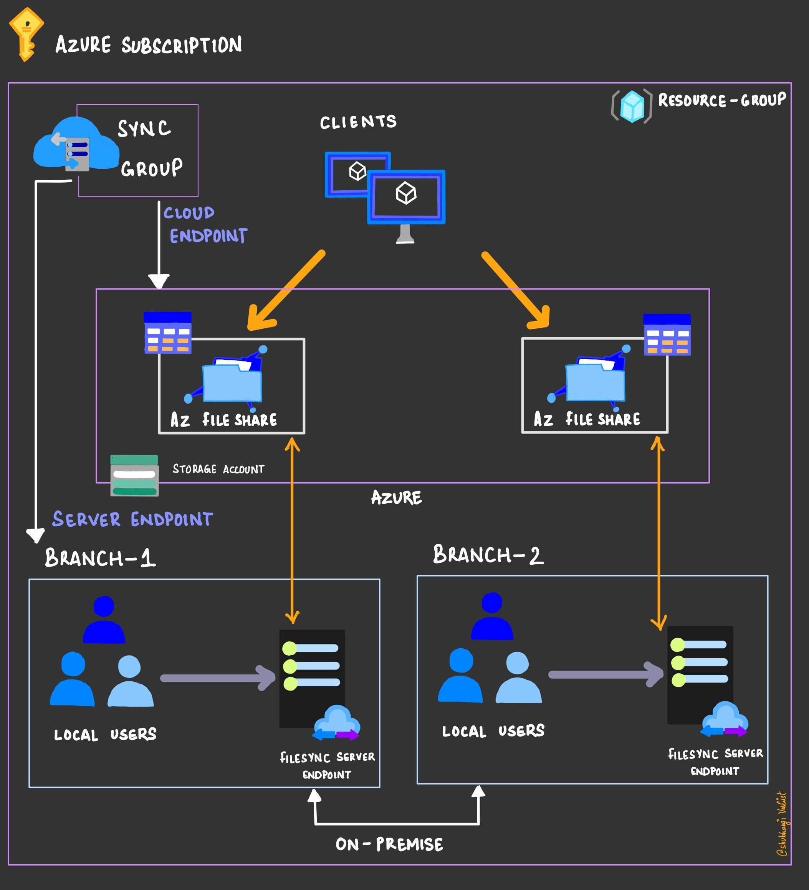

# Project for AZ-900 - Implement Hybrid file share with disaster recovery

Hi, my intention in developing these projects is to make learning enjoyable. By examining real-life implementations of cloud services, you can gain a deeper understanding of the concepts, making learning more engaging and aiding in better retention of the material, which is beneficial for passing the AZ-900 exam.

In this project, we implement a simple architecture of a Hybrid File share using Python SDK as well as the Azure portal.  

## Azure Services that you will learn
- Azure Storage
- Azure File Share service
- Azure File Sync service
- Azure Virtual machine

## Architecture 

- GitHub for Version control.
- Azure Storage account to deploy file share in both branches.
- Azure File Share to provide a cloud platform for the files to sync from the on-premise servers.
- Azure Storage sync service to deploy file sync service.
- Virtual machine to simulate the on-premise servers.
- Azure file sync agent to create a server endpoint on the virtual machine. 
- [Python](https://learn.microsoft.com/en-us/azure/developer/python/sdk/azure-sdk-overview) for our Infrastructure as Code.

## You'll need

- [Azure account](azure.com/free)
- [GitHub account](github.com/join)
- Prerequisite: Azure subscription

For local developer environment

- VS Code/ Jupyter notebook
- Docker (optional)

## How to get started

### Authenticate your Environment with Azure
In the Terminal, type `az login --use-device-code` to log into your Azure account from the az cli.

### Get the code and environment

1. [Fork the repository](https://docs.github.com/pull-requests/collaborating-with-pull-requests/working-with-forks/about-forks) so you can have your own copy of it. 
2. If you don't already have Jupyter notebook installed, navigate to [python](https://jupyter.org/) and download the latest version. Follow the installation instructions for the setup.
3. Launch Jupyter notebook and open [main.py](main.py) and [defaults.py](defaults.py). 
4. Replace the parameters in [defaults.py](defaults.py) with your own. You can modify the other default parameters or leave them as it is(your choice).
5. Now execute main.py to build the sample architecture.

### How the codebase works
Refer my [blog](https://shubhangivashist.medium.com/queue-based-load-leveling-pattern-in-cloud-hosted-applications-039b2ad8f378) to understand the working of the codebase.
        
